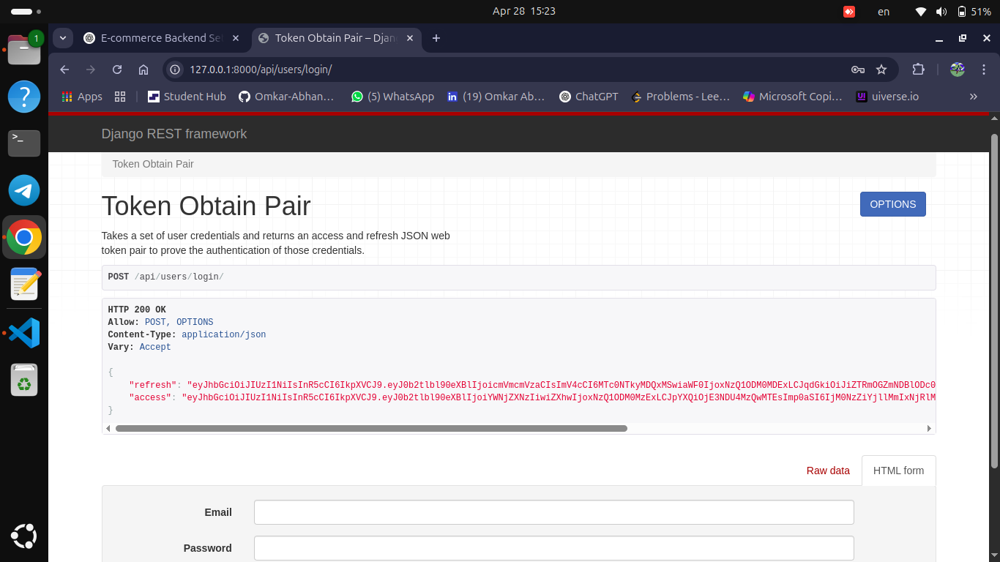
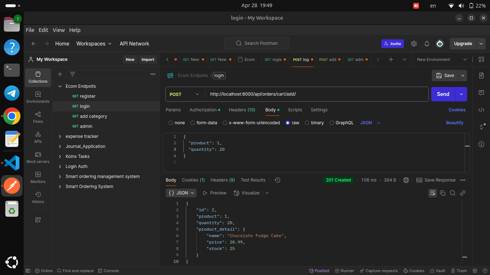
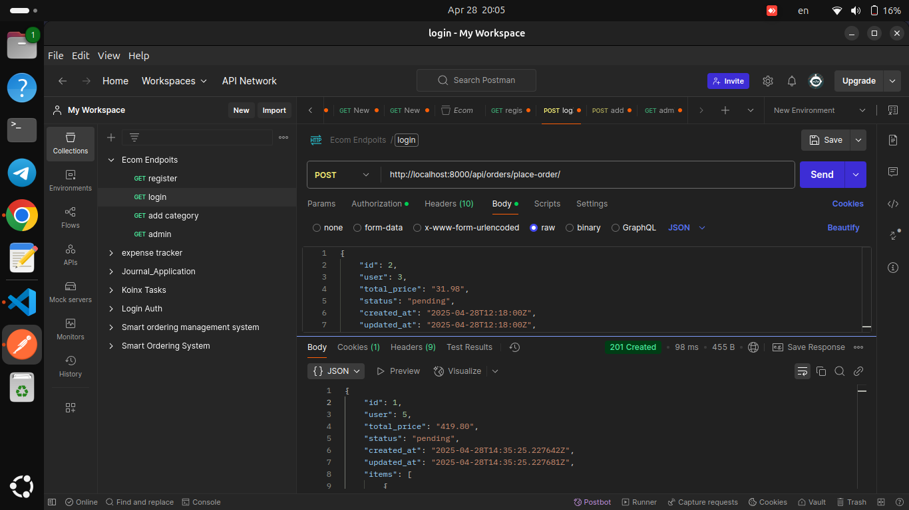
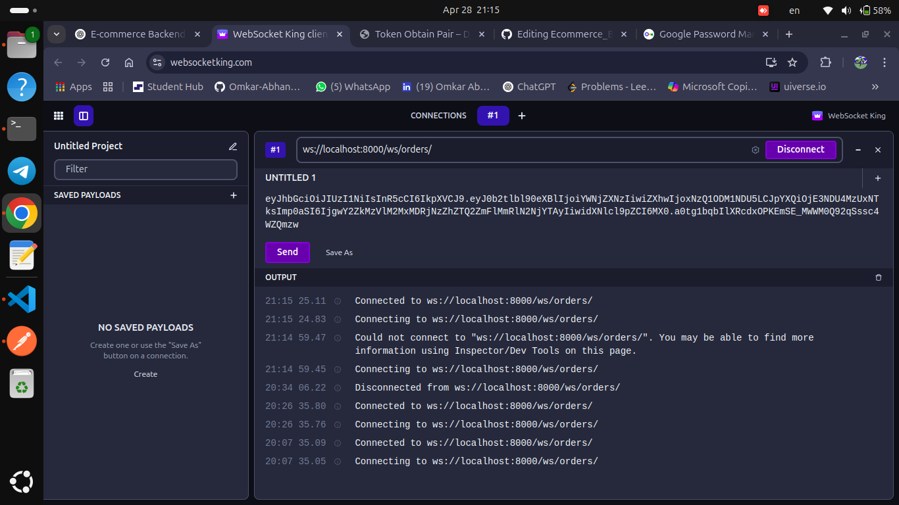

# E-commerce Backend

An advanced E-commerce backend system built with Django, Django REST Framework, Redis, and Django Channels.
This project includes real-time WebSocket notifications for live order updates!

---

#  Features

| Module | Features |
|:------|:--------|
| Authentication | JWT-based Register/Login/Profile APIs |
| Product Management | CRUD for Products and Categories (Admin only) |
| Cart System | Add/View/Delete Cart Items |
| Order System | Place Orders from Cart, Track Status (Pending → Shipped → Delivered) |
| Caching | Redis caching for Product and Category listing |
| Pagination/Filtering | Pagination (10 per page), Search, Filter by Category/Stock |
| Real-time Notifications | WebSocket push for live Order Status Updates |

---

#  Tech Stack

- Python 3.10+
- Django 4+
- Django REST Framework (DRF)
- Django Channels (WebSocket)
- Redis (Caching + Channels Layer)
- PostgreSQL (or SQLite for testing)
- Daphne ASGI Server

---

# 🚿 Project Setup

### 1. Clone Repository
```bash
git clone https://github.com/your-username/enlog-ecommerce-backend.git
cd enlog-ecommerce-backend
```

### 2. Create Virtual Environment & Activate
```bash
python3 -m venv venv
source venv/bin/activate
```

### 3. Install Required Packages
```bash
pip install -r requirements.txt
```

### 4. Configure Database (Optional)
- Default is SQLite. For PostgreSQL, update `DATABASES` in `settings.py`.

### 5. Run Migrations
```bash
python manage.py makemigrations
python manage.py migrate
```

### 6. Create Superuser (Admin)
```bash
python manage.py createsuperuser
```

### 7. Start Redis Server
```bash
# If using docker-compose
docker-compose up -d redis

# OR if installed manually
redis-server
```

### 8. Run Server with Daphne (for WebSocket Support)
```bash
pip install daphne

daphne -b 0.0.0.0 -p 8000 Ecom_Backend.asgi:application
```

---

#  API Endpoints

## Authentication
| URL | Method | Description |
|:---|:---|:---|
| `/api/users/register/` | POST | User Registration |
| `/api/users/login/` | POST | User Login (JWT Token) |
| `/api/users/profile/` | GET/PATCH | View/Update Profile |

## Products & Categories
| URL | Method | Description |
|:---|:---|:---|
| `/api/products/categories/` | CRUD | Manage Product Categories |
| `/api/products/products/` | CRUD | Manage Products |

## Cart Management
| URL | Method | Description |
|:---|:---|:---|
| `/api/orders/cart/` | GET | View Cart |
| `/api/orders/cart/add/` | POST | Add Product to Cart |
| `/api/orders/cart/remove/{id}/` | DELETE | Remove Item from Cart |

## Order Management
| URL | Method | Description |
|:---|:---|:---|
| `/api/orders/place-order/` | POST | Place Order from Cart |
| `/api/orders/update-order/{id}/` | PATCH | Admin: Update Order Status |

## WebSocket for Notifications
| URL | Type | Description |
|:---|:---|:---|
| `ws://localhost:8000/ws/orders/` | WebSocket | Receive live order status updates |

---

#  API Testing Screenshots (Postman)


### 1. User Registration


### 2. User Login (JWT Token)


### 3. Add Product to Cart


### 4. Place Order


### 5. WebSocket Live Notification


---

# Pagination & Filtering

- Product Listing: `/api/products/products/?page=1`
- Search Products: `/api/products/products/?search=cake`
- Filter by Category: `/api/products/products/?category=1`
- Sort by Price: `/api/products/products/?ordering=price`


---

#  Performance Features

- Redis caching for fast Product/Category load.
- WebSocket notifications for order status change.
- Admin-only permissions on sensitive APIs.


---

#  WebSocket Testing (Using WebSocket King)

1. Go to [https://websocketking.com/](https://websocketking.com/)
2. Connect to: `ws://localhost:8000/ws/orders/`
3. Place an Order -> Admin updates Order Status
4. Receive real-time notification instantly!

---


#Author

Made with ❤️ by Omkar Abhang


